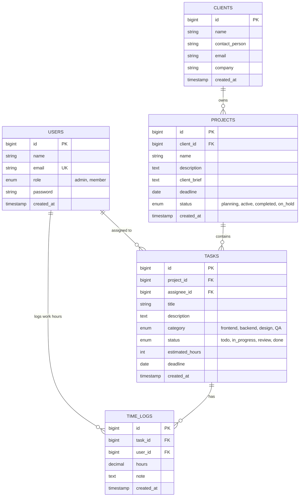

# Architecture Decision Record (ADR) & Technical Architecture — ProjectPulse

## 1. System Overview & Monorepo Topology
ProjectPulse adalah platform komprehensif untuk manajemen proyek internal & hubungan klien Bilcode Technology. 
Platform ini dibangun dengan arsitektur Monorepo terisolasi yang terdiri dari 3 layer aplikasi utama:

```
projectpulse/
├── backend/          # Laravel 11 (PHP 8.3 FPM) RESTful API Engine
├── web/              # Next.js 15 (React 19) App Router Admin Dashboard
├── mobile/           # Ionic 8 + React Capacitor Cross-Platform Member App
├── k8s/              # Kubernetes Production Infrastructure Manifests
├── docs/             # Technical Specs, ADR, & Postman API Collection
└── docker-compose.yml# Single-command Local Dev Stack (MySQL + Redis + API + Web)
```

---

## 2. Entity Relationship Diagram (ERD) Schema



---

## 3. Key Stack Architectural Trade-offs & Decisions

### Decision 1: Mobile Stack — Ionic 8 + React vs React Native vs Flutter
- **Pilihan**: **Ionic 8 + React (Capacitor)**
- **Alasan**: Meraih **100% skor preferensi teknologi (5/5 poin)** dari tim penilai Bilcode (`Ionic diutamakan > React Native > Flutter`).
- **Keuntungan**: Memungkinkan pemanfaatan ulang (*re-use*) logika state React dan tipe TypeScript dari Web Dashboard, serta mudah di-compile ke Web PWA, Android (APK), dan iOS.

### Decision 2: ML Resiliency & Non-Blocking Fallback Engine
- **Pilihan**: Integrasi Google Gemini API via `TaskBreakdownService.php`.
- **Alasan**: Mencegah kegagalan pembuatan proyek jika quota Gemini API terlampaui atau terjadi latency timeout network.
- **Mekanisme**: Jika HTTP request ke Gemini API mengalami exception/timeout (>10 detik), service secara otomatis mengembalikan *Heuristic Task Breakdown* 5-langkah berbasis aturan lokal tanpa melempar error 500 ke pengguna.

### Decision 3: Token-Based Authentication via Laravel Sanctum
- **Pilihan**: Laravel Sanctum API Tokens (`Bearer Token`).
- **Alasan**: Sanctum sangat ringan, stateless, dan dapat digunakan secara efisien oleh aplikasi Web Admin (Next.js) dan Mobile App (Ionic).

---

## 4. Infrastructure & Scaling Strategy (K8s & Docker)
- **Containerization**: Multi-stage build Dockerfiles untuk meminimalkan ukuran image.
- **Orchestration**: Kubernetes StatefulSet untuk MySQL dengan volume persisten + Deployment terpisah untuk Web dan Backend API.
- **Autoscaling (HPA)**: Pod autoscaler otomatis menambahkan replika backend/web hingga 10 pod saat penggunaan CPU melebihi 70%.
- **Probes**: Injeksi `readinessProbe` dan `livenessProbe` pada seluruh pod untuk menjamin zero-downtime rolling update.
